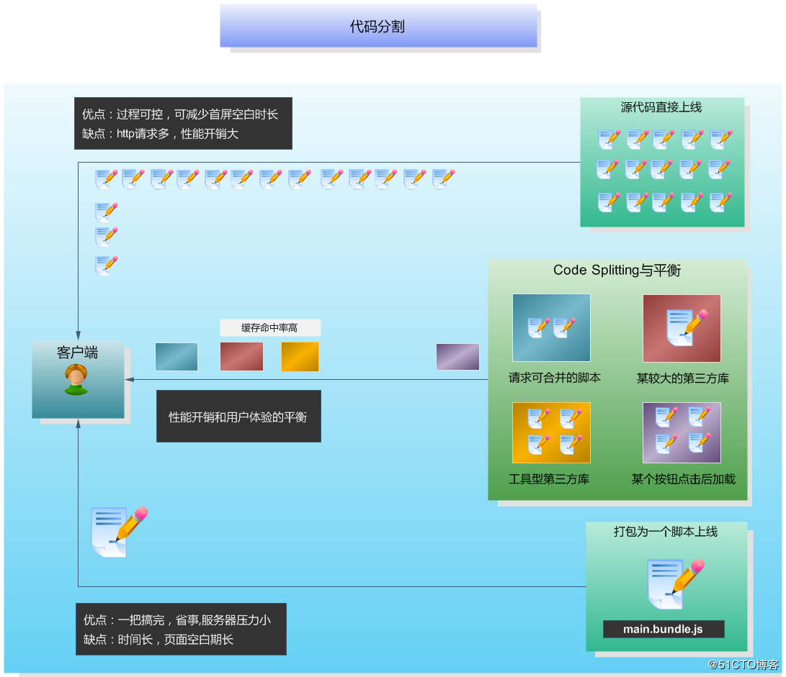
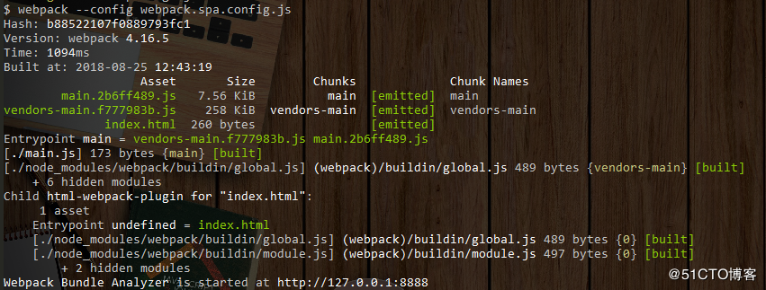
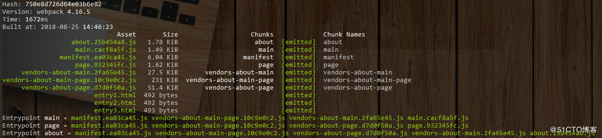
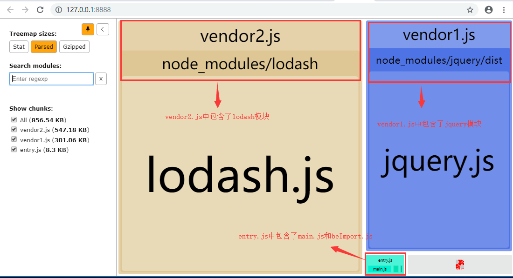
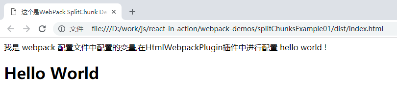
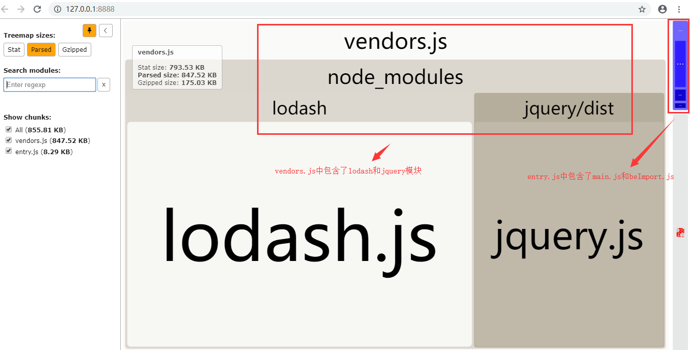
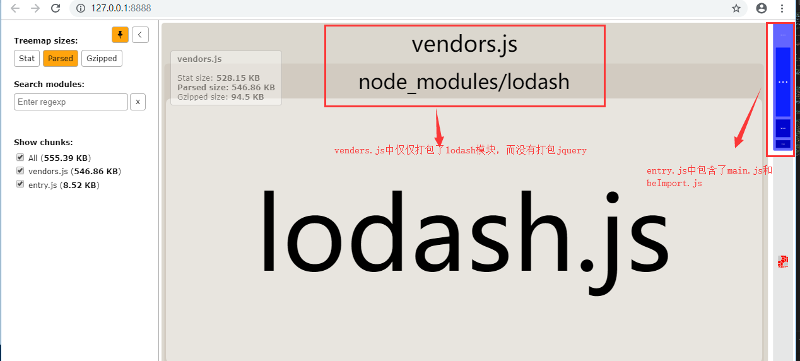

# Webpack 代码分割


## **为什么要进行代码分割** 

代码分割最基本的任务是分离出第三方依赖库，因为第三方库的内容可能很久都不会变动，所以用来标记变化的摘要哈希`contentHash`也很久不变，这也就意味着我们可以利用本地缓存来避免没有必要的重复打包，并利用浏览器缓存避免冗余的客户端加载。另外当项目发布新版本时，如果第三方依赖的`contentHash`没有变化，就可以使用客户端原来的缓存文件（通用的做法一般是给静态资源请求设置一个很大的`max-age`），提升访问速度。另外一些场景中，代码分割也可以提供对脚本在整个加载周期内的加载时机的控制能力。 


## **代码分割的使用场景** 

举个很常见的例子，比如你在做一个数据可视化类型的网站，引用到了百度的`Echarts`作为第三方库来渲染图表，如果你将自己的代码和`Echarts`打包在一起生成一个`main.bundle.js`文件，这样的结果就是在一个网速欠佳的环境下打开你的网站时，用户可能需要面对很长时间的白屏，你很快就会想到将`Echarts`从主文件中剥离出来，让体积较小的主文件先在界面上渲染出一些动画或是提示信息，然后再去加载`Echarts`，而分离出的`Echarts`也可以从速度更快的`CDN`节点获取，如果加载某个体积庞大的库，你也可以选择使用懒加载的方案，将脚本的下载时机延迟到用户真正使用对应的功能之前。这就是一种人工的代码分割。

从上面的例子整个的生命周期来看，我们将原本一次就可以加载完的脚本拆分为了两次，这无疑会加重服务端的性能开销，毕竟建立TCP连接是一种开销很大的操作，但这样做却可以换来**对渲染节奏的控制和用户体验的提升**，**异步模块**和**懒加载模块**从宏观上来讲实际上都属于**代码分割**的范畴。`code splitting`最极端的状况其实就是拆分成打包前的原貌，也就是**源码直接上线**。


## 代码拆分与不拆分的比较




> 代码分割的本质，就是在**“源码直接上线”**和**“打包为唯一的脚本main.bundle.js”**这两种极端方案之间寻找一种更符合实际场景的中间状态，用可接受的服务器性能压力增加来换取更好的用户体验。 


## 更细致的代码分割

感兴趣的读者可以参考来自google开发者社区的文章[ 《Reduce JavaScript Payloads with Code Splitting》 ](https://developers.google.com/web/fundamentals/performance/optimizing-javascript/code-splitting/)自行研究。


## 细说splitChunks技术

### 参数说明

`webpack4`废弃了`CommonsChunkPlugin`插件，使用`optimization.splitChunks`和`optimization.runtimeChunk`来代替，原因可以参考[《webpack4：连奏中的进化》](https://www.cnblogs.com/wmhuang/p/8967639.html)一文。关于`runtimeChunk`参数，有的文章说是提取出入口chunk中的runtime部分，形成一个单独的文件，由于这部分不常变化，可以利用缓存。google开发者社区的博文是这样描述的： 

>  [The `runtimeChunk` option](https://webpack.js.org/configuration/optimization/#optimization-runtimechunk) is also specified to move [webpack's runtime](https://webpack.js.org/concepts/manifest/#runtime) into the `vendors` chunk to avoid duplication of it in our app code. 

`splitChunks`中默认的代码自动分割要求是下面这样的： 

- node_modules中的模块或其他被重复引用的模块

  就是说如果引用的模块来自`node_modules`,那么只要它被引用，那么满足其他条件时就可以进行自动分割。否则该模块需要被重复引用才继续判断其他条件。（对应的就是下文配置选项中的`minChunks`为1或2的场景）

- 分离前模块最小体积下限（默认30k，可修改）

  30k是官方给出的默认数值，它是可以修改的，上一节中已经讲过，每一次分包对应的都是服务端的性能开销的增加，所以必须要考虑分包的性价比。

- 对于异步模块，生成的公共模块文件不能超出5个（可修改）

  触发了懒加载模块的下载时，并发请求不能超过5个，对于稍微了解过服务端技术的开发者来说，**【高并发】**和**【压力测试】**这样的关键词应该不会陌生。

- 对于入口模块，抽离出的公共模块文件不能超出3个（可修改）

  也就是说一个入口文件的最大并行请求默认不得超过3个，原因同上。


### 参数配置

`splitChunks`的在`webpack`4.0以上版本中的用法是下面这样的： 

```
module.exports = {
  //...
  optimization: {
    splitChunks: {
      chunks: 'async',//默认只作用于异步模块，为`all`时对所有模块生效,`initial`对同步模块有效
      minSize: 30000,//合并前模块文件的体积
      minChunks: 1,//最少被引用次数
      maxAsyncRequests: 5,
      maxInitialRequests: 3,
      automaticNameDelimiter: '~',//自动命名连接符
      cacheGroups: {
        vendors: {
          test: /[\\/]node_modules[\\/]/,
          minChunks:1,//敲黑板
          priority: -10//优先级更高
        },
        default: {
          test: /[\\/]src[\\/]js[\\/]/
          minChunks: 2,//一般为非第三方公共模块
          priority: -20,
          reuseExistingChunk: true
        }
      },
      runtimeChunk:{
          name:'manifest'
      }
    }
  }
```


### 代码分割实例

- 单页面应用 

  单页面应用只有一个入口文件，`splitChunks`的主要作用是将引用的第三方库拆分出来。从下面的分包结果就可以看出，`node_modules`中的第三方引用被分离了出来，放在了`vendors-main.[hash].js`中。 




- 多页面应用 

  多页面应用的情形稍显复杂，以[《webpack4：连奏中的进化》](https://www.cnblogs.com/wmhuang/p/8967639.html)一文中的例子进行代码分割处理，源码的依赖关系为：

  ```
  entryA.js: vue vuex component10k
  entryB.js: vue axios component10k
  entryC.js: vue vuex axios component10k
  ```

  经过代码分割后得到的包如下图所示：

 


 `splitChunks`提供了更精确的分割策略，但是似乎无法直接通过`html-webpack-plugin`配置参数来动态解决分割后代码的注入问题，因为分包名称是不确定的。这个场景在使用`chunks:'async'`默认配置时是不存在的，因为异步模块的引用代码是不需要以`&lt;script&gt;`标签的形式注入`html`文件的。

当`chunks`配置项设置为`all`或`initial`时，就会有问题，例如上面示例中，通过在`html-webpack-plugin`中配置`excludeChunks`可以去除*page*和*about*这两个chunk，但是却无法提前排除*vendors-about-page*这个chunk，因为打包前无法知道是否会生成这样一个chunk。这个场景笔者并没有找到现成的解决方案，对此场景有需求的读者也许可以通过使用`html-webpack-plugin`的**事件扩展**来处理此类场景，也可以使用折中方案，就是第一次打包后记录下新生成的chunk名称，按需填写至`html-webpack-plugin`的`chunks`配置项里。


## 例子

本例子使用了jquery和lodash作为第三方模块，所以先要安装这两个模块

> npm install jquery lodash --save

下面是例子中的主要的业务代码

**beImport.js**  被引入的自定义的模块,非常简单,仅仅封装了console.log函数

```
var show = function(a){
    console.log(a);
}
export {show as show};
```

**main.js** 主代码，引入了jquery和lodash两个第三方库和上面的beImport.js模块

```
import {show} from './beImport';
import $ from 'jquery';
import _ from 'lodash';
debugger;
console.log($);
$("#demo").html('<h1>Hello World</h1>');
show("我是被引入的JS - show()函数");
console.log(_.chunk(['a', 'b', 'c', 'd'], 3));
console.log("finish")


```

index.html 首页模板页面

```
<html>
  <head>
    <meta charset="utf-8"/>
    <title><%= htmlWebpackPlugin.options.title %></title>
  </head>
  <body>
      <%= htmlWebpackPlugin.options.sss %>
      <div id="demo"></div>
     
  </body>
</html>

```


### 例子一 ： 将某些第三方模块单独打包

在实际的引用中，jquery和lodash等第三方库一般情况下不会改变，我们可以将jquery和lodash打包(上面提到的浏览器可以将这些内容缓存下来提供用户访问速度)，下面是webpack的配置

```

//拷贝首页，并添加js引用 、压缩、替换文本等功能
const HtmlWebpackPlugin = require('html-webpack-plugin')
//该插件功能是打包前先清空目标文件夹
const CleanWebpackPlugin = require('clean-webpack-plugin');
//复制静态文件
const CopyWebpackPlugin = require('copy-webpack-plugin');

const UglifyJSPlugin = require('uglifyjs-webpack-plugin');
//生成分析报告
const BundleAnalyzerPlugin = require('webpack-bundle-analyzer').BundleAnalyzerPlugin;

module.exports = {
  //mode:生产模式production(会压缩代码)  开发模式development(不会压缩代码)
  mode:"development", 
  //三个入口,也就是生成的index.html中会自动进入下面三个打好包的JS 
  //<script type="text/javascript" src="vendor2.js"></script>
  //<script type="text/javascript" src="vendor1.js"></script>
  //<script type="text/javascript" src="entry.js"></script>
  entry: {
    entry: ['./main.js'],
    vendor1:['jquery'], // verdor1包含了jquery模块
    vendor2:['lodash']  //verdor2 包含了lodash模块
  },

  optimization:{
    splitChunks: {
      cacheGroups: {
          vendor1: { 
              chunks: 'initial',
              name: 'vendor1',  //对应entry的vendor1属性
              test: 'vendor1',
              enforce: true
          },
          vendor2: {
            chunks: 'initial',
            name: 'vendor2', //对应entry的vendor2属性
            test: 'vendor2',
            enforce: true
          }
      }
    }
  },
 
  
  //打包后的文件路径 (webpack4默认dist目录下)
  output: {
    filename: '[name].js' //默认dist目录下   [name]为entry的属性值
  },

  devServer: {
    public: '127.0.0.1:7890',
    port : "7890",

    open: true,// 自动打开浏览器
    //hot: true,// 开启热更新  
    contentBase: __dirname+'/dist',//本地服务器所加载的页面所在的目录
    historyApiFallback: true,//不跳转
    inline: true//实时刷新
  },


  


  plugins: [
    //清理文件夹
    new CleanWebpackPlugin('dist') ,
    //拷贝模板并添加js引用 替换模板变量
    new HtmlWebpackPlugin({
      filename:'./index.html', //通过模板生成的文件名
        template:'./index.html',//模板路径
        inject:true, //是否自动在模板文件添加 自动生成的js文件链接的位置 允许插件修改哪些内容，true/'head'/'body'/false,
        title:'这个是WebPack SplitChunk Demo',
        sss:"我是 webpack 配置文件中配置的变量,在HtmlWebpackPlugin插件中进行配置 hello world !",

        //minify属性详解：https://github.com/kangax/html-minifier#options-quick-reference
        minify:{
          removeComments:true ,//是否压缩时 去除注释
          minifyCSS:true,//是否压缩style 样式(在index.html中的样式非外部样式)
          minifyJS:true,//是否压缩直接出现在页面中的js
        }
    }),


    //拷贝静态资源
    //new CopyWebpackPlugin([
      // to 默认的是dist文件夹是根目录
    //  { from: 'css/antd.css',to:'css/antd.css' },
    //]),


    //包引用分析
    new BundleAnalyzerPlugin({
      //  可以是`server`，`static`或`disabled`。
      //  在`server`模式下，分析器将启动HTTP服务器来显示软件包报告。
      //  在“静态”模式下，会生成带有报告的单个HTML文件。
      //  在`disabled`模式下，你可以使用这个插件来将`generateStatsFile`设置为`true`来生成Webpack Stats JSON文件。
      analyzerMode: 'server',
      //  将在“服务器”模式下使用的主机启动HTTP服务器。
      analyzerHost: '127.0.0.1',
      //  将在“服务器”模式下使用的端口启动HTTP服务器。
      analyzerPort: 8888, 
      //  路径捆绑，将在`static`模式下生成的报告文件。
      //  相对于捆绑输出目录。
      reportFilename: 'report.html',
      //  模块大小默认显示在报告中。
      //  应该是`stat`，`parsed`或者`gzip`中的一个。
      //  有关更多信息，请参见“定义”一节。
      defaultSizes: 'parsed',
      //  在默认浏览器中自动打开报告
      openAnalyzer: true,
      //  如果为true，则Webpack Stats JSON文件将在bundle输出目录中生成
      generateStatsFile: false, 
      //  如果`generateStatsFile`为`true`，将会生成Webpack Stats JSON文件的名字。
      //  相对于捆绑输出目录。
      statsFilename: 'stats.json',
      //  stats.toJson（）方法的选项。
      //  例如，您可以使用`source：false`选项排除统计文件中模块的来源。
      //  在这里查看更多选项：https：  //github.com/webpack/webpack/blob/webpack-1/lib/Stats.js#L21
      statsOptions: null,
      logLevel: 'info'// 日志级别。可以是'信息'，'警告'，'错误'或'沉默'。
    })
  ],

};
```

执行`webpack`命令后会自动打开分析结果



可以看到，lodash和jquery分别被打包到lodash.js和jquery.js中，而我们自己写的业务代码(main.js和beImport.js)被打包到entry.js中

在看下我们生成的dist/index.html

```
<html>
  <head>
    <meta charset="utf-8">
    <title>这个是WebPack SplitChunk Demo</title>
  </head>
  <body>
      我是 webpack 配置文件中配置的变量,在HtmlWebpackPlugin插件中进行配置 hello world !
      <div id="demo"></div>
     
  <script type="text/javascript" src="vendor2.js"></script><script type="text/javascript" src="vendor1.js"></script><script type="text/javascript" src="entry.js"></script></body>
</html>

```

可以看到在页面`</body>`标签结束前已经引用了verdor2.js，verdor1.js，entry.js，打开该页面的结果如下：



我们写的main.js中的代码已经正确执行，说明该引用的jquery、lodash已经正确引入。


如果我们要把jquery和lodash等第三方包(node_modules中引入的模块)打在一起怎么办，只要按照下面的内容修改即可

```
//单个入口文件
  entry: {
    entry: ['./main.js']
  },
  optimization:{
    splitChunks: {
      cacheGroups: {
        commons: {
          test: /[\\/]node_modules[\\/]/,
          name: 'vendors',
          chunks: 'all'
        }
      }
    }
  },
  
  //打包后的文件路径 (webpack4默认dist目录下)
  output: {
    filename: '[name].js' //默认dist目录下   [name]为entry的属性值
  },
```

执行`webpack`命令后分析结果如下



vendors.js中已经包含了lodash和jquery模块。


生成的index.html内容如下

```
<html>
  <head>
    <meta charset="utf-8">
    <title>这个是WebPack Demo</title>
  </head>
  <body>
      hello world !
      <div id="demo"></div>
     
  <script type="text/javascript" src="vendors.js"></script><script type="text/javascript" src="entry.js"></script></body>
</html>

```

webpack就会把jquery和lodash等在node_modules中的模块全部打包到vendors.js中了。我们自己的业务代码还是打包到entry.js中。完整的webpack.config.js配置如下：

```

//拷贝首页，并添加js引用 、压缩、替换文本等功能
const HtmlWebpackPlugin = require('html-webpack-plugin')
//该插件功能是打包前先清空目标文件夹
const CleanWebpackPlugin = require('clean-webpack-plugin');
//复制静态文件
const CopyWebpackPlugin = require('copy-webpack-plugin');

const UglifyJSPlugin = require('uglifyjs-webpack-plugin');
//生成分析报告
const BundleAnalyzerPlugin = require('webpack-bundle-analyzer').BundleAnalyzerPlugin;

module.exports = {
  //mode:生产模式production(会压缩代码)  开发模式development(不会压缩代码)
  mode:"development", 

  
  //单个入口文件
  entry: {
    entry: ['./main.js']
  },
  optimization:{
    splitChunks: {
      cacheGroups: {
        commons: {
          test: /[\\/]node_modules[\\/]/,
          name: 'vendors',
          chunks: 'all'
        }
      }
    }
  },
  
  //打包后的文件路径 (webpack4默认dist目录下)
  output: {
    filename: '[name].js' //默认dist目录下   [name]为entry的属性值
  },

  devServer: {
    public: '127.0.0.1:7890',
    port : "7890",

    open: true,// 自动打开浏览器
    //hot: true,// 开启热更新  
    contentBase: __dirname+'/dist',//本地服务器所加载的页面所在的目录
    historyApiFallback: true,//不跳转
    inline: true//实时刷新
  },


  


  plugins: [
    //清理文件夹
    new CleanWebpackPlugin('dist') ,
    //拷贝模板并添加js引用 替换模板变量
    new HtmlWebpackPlugin({
      filename:'./index.html', //通过模板生成的文件名
        template:'./index.html',//模板路径
        inject:true, //是否自动在模板文件添加 自动生成的js文件链接的位置 允许插件修改哪些内容，true/'head'/'body'/false,
        title:'这个是WebPack Demo',
        sss:"hello world !",

        //minify属性详解：https://github.com/kangax/html-minifier#options-quick-reference
        minify:{
          removeComments:true ,//是否压缩时 去除注释
          minifyCSS:true,//是否压缩style 样式(在index.html中的样式非外部样式)
          minifyJS:true,//是否压缩直接出现在页面中的js
        }
    }),


    //拷贝静态资源
    //new CopyWebpackPlugin([
      // to 默认的是dist文件夹是根目录
    //  { from: 'css/antd.css',to:'css/antd.css' },
    //]),


    //包引用分析
    new BundleAnalyzerPlugin({
      //  可以是`server`，`static`或`disabled`。
      //  在`server`模式下，分析器将启动HTTP服务器来显示软件包报告。
      //  在“静态”模式下，会生成带有报告的单个HTML文件。
      //  在`disabled`模式下，你可以使用这个插件来将`generateStatsFile`设置为`true`来生成Webpack Stats JSON文件。
      analyzerMode: 'server',
      //  将在“服务器”模式下使用的主机启动HTTP服务器。
      analyzerHost: '127.0.0.1',
      //  将在“服务器”模式下使用的端口启动HTTP服务器。
      analyzerPort: 8888, 
      //  路径捆绑，将在`static`模式下生成的报告文件。
      //  相对于捆绑输出目录。
      reportFilename: 'report.html',
      //  模块大小默认显示在报告中。
      //  应该是`stat`，`parsed`或者`gzip`中的一个。
      //  有关更多信息，请参见“定义”一节。
      defaultSizes: 'parsed',
      //  在默认浏览器中自动打开报告
      openAnalyzer: true,
      //  如果为true，则Webpack Stats JSON文件将在bundle输出目录中生成
      generateStatsFile: false, 
      //  如果`generateStatsFile`为`true`，将会生成Webpack Stats JSON文件的名字。
      //  相对于捆绑输出目录。
      statsFilename: 'stats.json',
      //  stats.toJson（）方法的选项。
      //  例如，您可以使用`source：false`选项排除统计文件中模块的来源。
      //  在这里查看更多选项：https：  //github.com/webpack/webpack/blob/webpack-1/lib/Stats.js#L21
      statsOptions: null,
      logLevel: 'info'// 日志级别。可以是'信息'，'警告'，'错误'或'沉默'。
    })
  ],

};
```

### 例子二  ： 某些第三方模块外部引用，不希望webpack将它打包

在上面的介绍中有些第三方模块我们希望在页面中通过`<script src="...">`的方式进行外部引入，例如第三方的模块通过cdn来引入。

还用上面例子中的jquery举例，

**index.html** 页面模板文件

```
<html>
  <head>
    <meta charset="utf-8"/>
    <title><%= htmlWebpackPlugin.options.title %></title>
    <script src="js/jquery.min.js"></script>
  </head>
  <body>
      <%= htmlWebpackPlugin.options.sss %>
      <div id="demo"></div>
     
  </body>
</html>

```

> 注意：我们将jquery.min.js进行了外部引入，因为我们不要再把jquery进行打包了

**webpack.config.js** 配置文件

```

//拷贝首页，并添加js引用 、压缩、替换文本等功能
const HtmlWebpackPlugin = require('html-webpack-plugin')
//该插件功能是打包前先清空目标文件夹
const CleanWebpackPlugin = require('clean-webpack-plugin');
//复制静态文件
const CopyWebpackPlugin = require('copy-webpack-plugin');

const UglifyJSPlugin = require('uglifyjs-webpack-plugin');
//生成分析报告
const BundleAnalyzerPlugin = require('webpack-bundle-analyzer').BundleAnalyzerPlugin;

module.exports = {
  //mode:生产模式production(会压缩代码)  开发模式development(不会压缩代码)
  mode:"development", 

  
  //单个入口文件
  entry: {
    entry: ['./main.js']
  },
  optimization:{
    splitChunks: {
      cacheGroups: {
        commons: {
          test: /[\\/]node_modules[\\/]/,
          name: 'vendors',
          chunks: 'all'
        }
      }
    }
  },
  //不要进行打包的组件
  externals: {
    jquery: 'jQuery'
  },
  
  //打包后的文件路径 (webpack4默认dist目录下)
  output: {
    filename: '[name].js' //默认dist目录下   [name]为entry的属性值
  },

  devServer: {
    public: '127.0.0.1:7890',
    port : "7890",

    open: true,// 自动打开浏览器
    //hot: true,// 开启热更新  
    contentBase: __dirname+'/dist',//本地服务器所加载的页面所在的目录
    historyApiFallback: true,//不跳转
    inline: true//实时刷新
  },

  
  


  plugins: [
    //清理文件夹
    new CleanWebpackPlugin('dist') ,
    //拷贝模板并添加js引用 替换模板变量
    new HtmlWebpackPlugin({
      filename:'./index.html', //通过模板生成的文件名
        template:'./index.html',//模板路径
        inject:true, //是否自动在模板文件添加 自动生成的js文件链接的位置 允许插件修改哪些内容，true/'head'/'body'/false,
        title:'这个是WebPack SplitChunk Demo',
        sss:"我是 webpack 配置文件中配置的变量,在HtmlWebpackPlugin插件中进行配置 hello world !",

        //minify属性详解：https://github.com/kangax/html-minifier#options-quick-reference
        minify:{
          removeComments:true ,//是否压缩时 去除注释
          minifyCSS:true,//是否压缩style 样式(在index.html中的样式非外部样式)
          minifyJS:true,//是否压缩直接出现在页面中的js
        }
    }),


    //拷贝静态资源
    new CopyWebpackPlugin([
      // to 默认的是dist文件夹是根目录
      { from: 'js/jquery.min.js',to:'js/jquery.min.js' },
    ]),


    //包引用分析
    new BundleAnalyzerPlugin({
      //  可以是`server`，`static`或`disabled`。
      //  在`server`模式下，分析器将启动HTTP服务器来显示软件包报告。
      //  在“静态”模式下，会生成带有报告的单个HTML文件。
      //  在`disabled`模式下，你可以使用这个插件来将`generateStatsFile`设置为`true`来生成Webpack Stats JSON文件。
      analyzerMode: 'server',
      //  将在“服务器”模式下使用的主机启动HTTP服务器。
      analyzerHost: '127.0.0.1',
      //  将在“服务器”模式下使用的端口启动HTTP服务器。
      analyzerPort: 8888, 
      //  路径捆绑，将在`static`模式下生成的报告文件。
      //  相对于捆绑输出目录。
      reportFilename: 'report.html',
      //  模块大小默认显示在报告中。
      //  应该是`stat`，`parsed`或者`gzip`中的一个。
      //  有关更多信息，请参见“定义”一节。
      defaultSizes: 'parsed',
      //  在默认浏览器中自动打开报告
      openAnalyzer: true,
      //  如果为true，则Webpack Stats JSON文件将在bundle输出目录中生成
      generateStatsFile: false, 
      //  如果`generateStatsFile`为`true`，将会生成Webpack Stats JSON文件的名字。
      //  相对于捆绑输出目录。
      statsFilename: 'stats.json',
      //  stats.toJson（）方法的选项。
      //  例如，您可以使用`source：false`选项排除统计文件中模块的来源。
      //  在这里查看更多选项：https：  //github.com/webpack/webpack/blob/webpack-1/lib/Stats.js#L21
      statsOptions: null,
      logLevel: 'info'// 日志级别。可以是'信息'，'警告'，'错误'或'沉默'。
    })
  ],

};
```

注意上面的externals属性，这个属性是不进行打包的模块，如下：

```
externals: {
    jquery: 'jQuery'
},
```

其他node_modules中的第三方模块打包到vendors.js中

执行`webpack`命令后的分析结果如下：



从打包结果中看vendors.js中仅仅包含了lodash模块，而没有打包jquery模块。

生成的index.html内容如下：

```
<html>
  <head>
    <meta charset="utf-8">
    <title>这个是WebPack SplitChunk Demo</title>
    <script src="js/jquery.min.js"></script>
  </head>
  <body>
      我是 webpack 配置文件中配置的变量,在HtmlWebpackPlugin插件中进行配置 hello world !
      <div id="demo"></div>
     
  <script type="text/javascript" src="vendors.js"></script><script type="text/javascript" src="entry.js"></script></body>
</html>

```

jquery.min.js为模板中存在的内容，而verdors.js和entry.js是webpack为我们打包的js，通过HtmlWebpackPlugin插件自动引入进来。


如果希望将lodash也不进行打包则将lodash模块也加入到externals属性中即可。

```
externals: {
    jquery: 'jQuery',
    lodash: 'lodash'
  },
```

按照这个配置后最后打包好的entry.js就仅仅包含我们的业务代码了(main.js和beImport.js)


## 代码下载

https://github.com/devil13th/react-in-action/tree/master/webpack-demos/splitChunksExample


